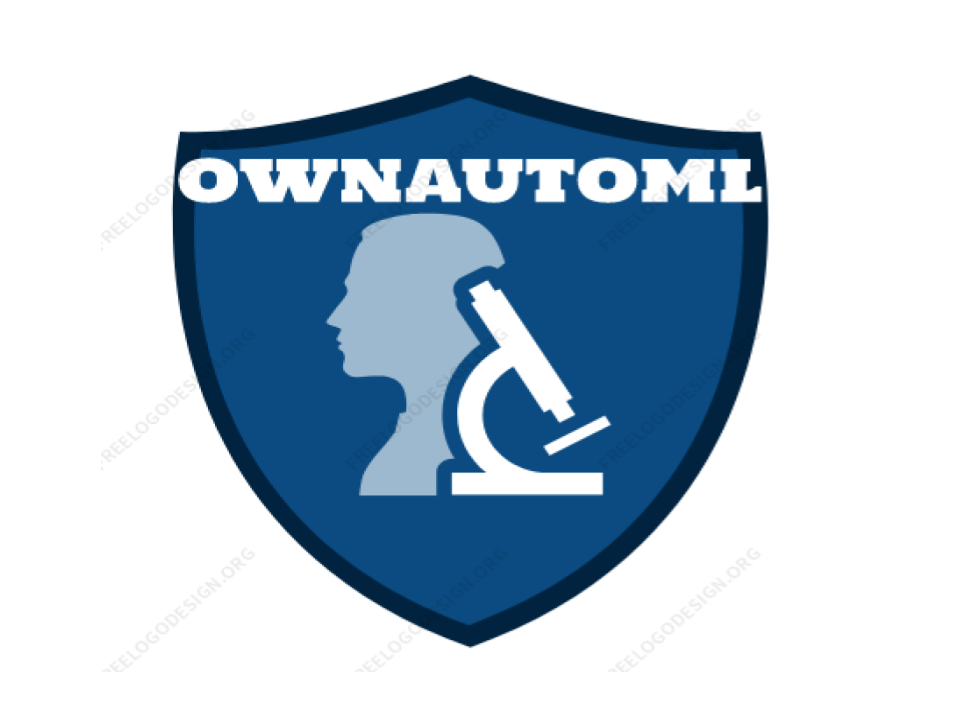

<p>
 
<a>  </a>
<a>  </a>
<a href="https://github.com/santhosh432/ownautoml/commits/main">
    
</a>
</p>

<p align="center">


</p>
 <hr>
## ownautoml

Ownautoml is an automated machine learning toolkit for command line and user interface level. It supports autoamted deployement with docker and django.

## Auto ML with your own setup with Django 

## Setup project

``` $ git clone https://github.com/santhosh432/ownautoml.git ``` 

``` $ cd ownautoml ```

``` $ pip install -r requirements.txt ```

``` $ python manage.py runserver ```

``` open http://127.0.0.1:8000/admin ```


## or 
Go to admin page and click on create project and fill up accordingly ....

 
